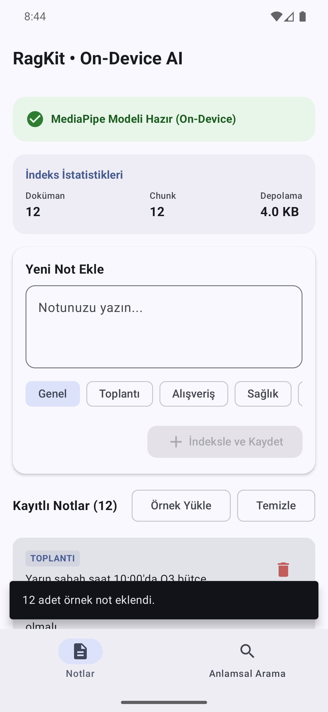
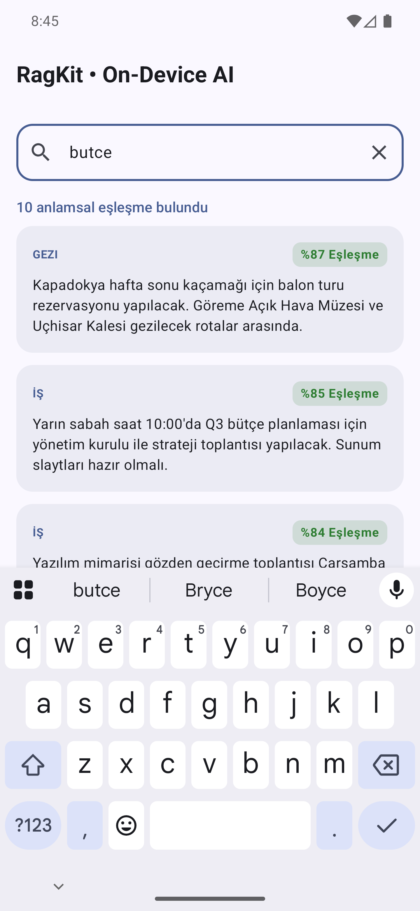

# ⚡ RagKit

[](https://github.com/Gurkan26/ragkit-android/actions)
[](https://search.maven.org/search?q=g:io.github.gurkan26)
[](LICENSE)
[](https://kotlinlang.org)
[](https://developer.android.com)

**RagKit** is a lightweight, modular, and privacy-preserving Android SDK that brings **on-device semantic search** to mobile applications. Instead of brittle exact-keyword matching, RagKit vectorizes user texts locally with MediaPipe and performs high-speed nearest-neighbor similarity searches using Room SQLite.

---

## 📱 Screenshots & Demo

<p align="center">
  
  &nbsp;&nbsp;&nbsp;&nbsp;
  
</p>

---

## 🌟 Key Features

- 🧠 **100% On-Device AI**: Zero server round-trips. User data never leaves the device.
- 📦 **Modular Architecture**: Clean separation between core abstractions (`ragkit-core`), vector storage (`ragkit-storage-room`), and ML inference (`ragkit-embedding-mediapipe`).
- ⚡ **Download-on-First-Use**: Automatically downloads and verifies ML models on first launch with real-time download progress callbacks.
- 🔄 **Reactive Flow Search**: Search queries automatically re-evaluate and stream updated results via Kotlin Coroutines `Flow` as database contents change.
- 🛡️ **Lifecycle & Memory Aware**: Integrates with Android `ComponentCallbacks2` to automatically unload native models during critical memory pressure.
- ✂️ **Smart Text Chunking**: Hierarchically splits long texts by paragraphs, sentences, and character windows with configurable overlap.

---

## 📐 Architecture

```
                  +-----------------------------------+
                  |         Your Android App          |
                  +-----------------------------------+
                                    |
            +-----------------------+-----------------------+
            |                                               |
            v                                               v
+-----------------------+                       +-----------------------+
|  ragkit-storage-room  |                       | ragkit-embedding-     |
|   (Room SQLite +      |                       |    mediapipe          |
|  Cosine Similarity)   |                       | (TextEmbedder API)    |
+-----------------------+                       +-----------------------+
            |                                               |
            +-----------------------+-----------------------+
                                    |
                                    v
                  +-----------------------------------+
                  |            ragkit-core            |
                  |  (Interfaces, Models, RagKit API) |
                  +-----------------------------------+
```

---

## 🚀 Quick Start (3 Lines)

```kotlin
val ragKit = RagKit.create(context) {
    embeddingEngine(MediaPipeEmbeddingEngine(context))
    storage(RoomRagStorage(context))
}

// 1. Index document
ragKit.index(RagDocument(text = "Emergency doctor appointment scheduled for Thursday."))

// 2. Semantic search (matches meaning, not exact words!)
val results = ragKit.search("health and medical visit")
```

---

## 📦 Installation

Add the dependencies to your module's `build.gradle.kts`:

```kotlin
dependencies {
    implementation("io.github.gurkan26:ragkit-core:0.1.0")
    implementation("io.github.gurkan26:ragkit-storage-room:0.1.0")
    implementation("io.github.gurkan26:ragkit-embedding-mediapipe:0.1.0")
}
```

---

## 💡 Usage Guide

### 1. Initialize RagKit

```kotlin
val embeddingEngine = MediaPipeEmbeddingEngine(context)
val storage = RoomRagStorage(context)

val ragKit = RagKit.builder(context)
    .embeddingEngine(embeddingEngine)
    .storage(storage)
    .config {
        maxChunkSize = 500   // Characters per chunk
        chunkOverlap = 50    // Overlapping characters
        maxResults = 10      // Max results per search
        minScore = 0.30f     // Minimum cosine similarity threshold (0.0 - 1.0)
    }
    .build()

// Initialize storage and model
lifecycleScope.launch {
    ragKit.initialize().onSuccess {
        println("RagKit is ready for semantic search!")
    }
}
```

### 2. Index Documents

```kotlin
val document = RagDocument(
    text = "Team sprint retrospective meeting scheduled on Friday at 4 PM.",
    source = "meeting",
    metadata = mapOf("department" to "engineering", "priority" to "high")
)

lifecycleScope.launch {
    ragKit.index(document).onSuccess {
        println("Document successfully indexed!")
    }
}
```

### 3. Query with Semantic Search

```kotlin
lifecycleScope.launch {
    val results = ragKit.search("when is the engineering discussion?", limit = 5)
    results.getOrNull()?.forEach { result ->
        println("Match: ${result.text} (Score: ${(result.score * 100).toInt()}%)")
    }
}
```

### 4. Real-time Reactive Search Flow

```kotlin
viewModelScope.launch {
    ragKit.searchFlow(query = "groceries and shopping")
        .collect { matches ->
            _uiState.update { it.copy(searchResults = matches) }
        }
}
```

---

## ⚙️ Configuration Reference

| Option | Type | Default | Description |
| :--- | :--- | :--- | :--- |
| `maxChunkSize` | `Int` | `500` | Maximum character length per text chunk window |
| `chunkOverlap` | `Int` | `50` | Characters shared between adjacent chunks to maintain context |
| `maxResults` | `Int` | `10` | Maximum number of top matching search results returned |
| `minScore` | `Float` | `0.30f` | Minimum normalized cosine similarity threshold (0.0 to 1.0) |

---

## 📊 Benchmark & Performance

- **Inference Speed**: ~8ms – 25ms per sentence embedding on modern ARM64 chips.
- **Storage Footprint**: Compact Little-Endian binary BLOB serialization (~400 bytes per 100-dim chunk).
- **Brute-Force Similarity**: Sub-millisecond vector search across 5,000+ chunks in SQLite.

---

## 🗺️ Roadmap

- [x] Initial Core Architecture & Kotlin DSL Builder
- [x] Room Vector Storage with Cosine Similarity
- [x] MediaPipe Text Embedder with Download-on-First-Use
- [x] Jetpack Compose Sample Application
- [ ] HNSW (Hierarchical Navigable Small World) index for 100,000+ chunk collections
- [ ] Hybrid BM25 keyword + Dense Vector search fusion (Reciprocal Rank Fusion)
- [ ] Kotlin Multiplatform (KMP) support (iOS via CoreML)

---

## 🤝 Contributing

Contributions are warmly welcomed! Please read our [CONTRIBUTING.md](CONTRIBUTING.md) guide before submitting a pull request.

---

## 📄 License

RagKit is released under the [Apache 2.0 License](LICENSE).
